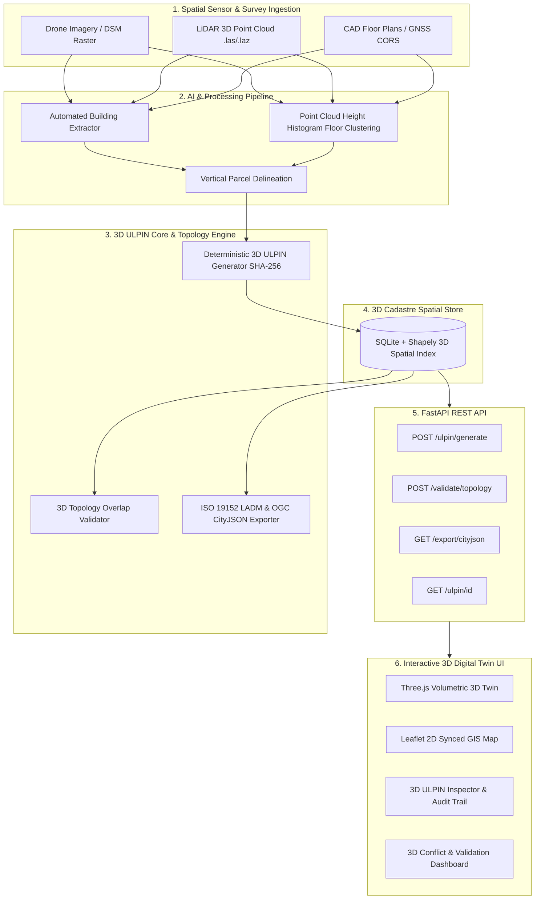

# SIH 2026 Problem Statement SIH26011 Compliance Write-Up
**Title**: 3D ULPIN Generation and Vertical Property Mapping System  
**Organization**: Ministry of Rural Development — Department of Land Resources (DoLR)  
**Theme**: Space Technology / Digital India Land Records Modernization Programme (DILRMP)  

---

## Executive Summary & Solution Alignment

India's existing 14-digit **ULPIN** (Unique Land Parcel Identification Number / Bhu-Aadhaar) represents 2D surface land boundaries using geo-referenced lat/long ground vertices. However, modern urban growth requires spatial governance across vertical (Z) dimensions—such as high-rise multi-story apartments, subterranean basements, underground metro transit corridors, utility networks, elevated expressways, and air-rights envelopes. 

The **3D ULPIN Engine** extends India's 2D land cadastre into a native 3D volumetric spatial mapping system fully aligned with **ISO 19152 LADM (3D Cadastre Extension)** and **OGC CityJSON 1.1**.

---

## Problem Requirement Mapping Matrix

| SIH26011 Problem Requirement | Solution Component & Implementation | Verification Proof / Feature |
| :--- | :--- | :--- |
| **1. Core Data Model & Vertical Bounds** | `SpatialUnit` model storing 2D footprint + `z_min` + `z_max` (meters MSL), unit type, ownership metadata, and provenance. | Native Shapely & 3D Extrusion math supporting apartments, basements, underground metro, elevated transit, and air-rights. |
| **2. Deterministic 3D ULPIN Format** | `<Base-2D-ULPIN>-B<BuildingID>-F<Floor>-U<Unit>-Z<zmin_zmax_hash>` *Example*: `14MH27042910-B01-F03-U02-Z0412` | Deterministic SHA-256 geometry+Z span hashing. Idempotent & repeatable. Labeled with mandatory governance disclaimer. |
| **3. Ingestion & AI/ML Pipeline** | Automated Building Footprint Extraction from DSM/Drone Imagery + Point-Cloud Height Histogram Clustering for floor slab segmentation. | `/processing/building-extraction` & `/processing/floor-segmentation` endpoints. |
| **4. 3D Topology & Volumetric Validation** | Multi-layer topology engine detecting Z-range errors (`z_min >= z_max`), horizontal sibling overlaps, true 3D volumetric clipping, and floor height monotonicity. | Detects 3D volumetric overlap between **Pune Metro Line 3 Underground Tunnel** and **Shree Ram Heights Basement 1** with exact m³ volume calculation (`VOLUMETRIC_CLIPPING`). |
| **5. 3D Digital Twin & 2D GIS Synced Viewer** | Interactive Three.js WebGL 3D volumetric twin + Leaflet 2D parcel GIS map. | Per-floor isolation, underground view toggle, volumetric color coding, 3D ULPIN code inspector, click selection. |
| **6. Backend REST API** | Python FastAPI server with `/ulpin/generate`, `/ulpin/{id}`, `/validate/topology`, `/export/cityjson`. | High-performance JSON REST endpoints with CORS and Pydantic validation. |
| **7. Interoperability & Standards** | ISO 19152 (LADM 3D Cadastre) class mapping (`LA_SpatialUnit3D` & `LA_LegalSpaceBuildingUnit`) + OGC CityJSON 1.1 exporter. | `/export/cityjson` endpoint generating downloadable OGC CityJSON files. |
| **8. Governance & Trust Framing** | Audit trail storing data source, capture timestamp, sensor model, AI confidence score, and candidate status. | Mandatory UI banner: *"Prototype 3D ULPIN — proposed format, candidate spatial unit requiring human verification before becoming authoritative."* |

---

## System Architecture Diagram

---

## Use Case Narrative & Demo Scenarios

1. **Underground Metro Tunnel vs. Private Basement Conflict**:
   The system ingests subsurface LiDAR data for Pune Metro Line 3 tunnel segment (Z=494.0m to Z=498.0m) and detects that it intersects vertically with Shree Ram Heights Basement 1 parking (Z=496.8m to Z=500.0m). The 3D Topology Validator automatically flags a `VOLUMETRIC_CLIPPING` critical error and calculates the 3D clipping volume in cubic meters.

2. **Air-Rights & Solar Corridor Protection**:
   A 30-meter high airspace envelope (`14MH27042910-B01-FAIR-AIR01-Z0412`) is registered above Building B01 from Z=530m to Z=560m MSL to safeguard solar access rights and restrict unauthorized high-rise vertical extensions.

3. **Municipal Tax Assessment & Multi-Mortgage Fraud Prevention**:
   By assigning a deterministic 3D ULPIN to every flat (e.g. `14MH27042910-B01-F03-U02-Z0412`), municipal tax authorities can assess un-registered floors, and banks can prevent double-mortgage fraud where 2D parcel deeds were previously misused for different vertical floors.
